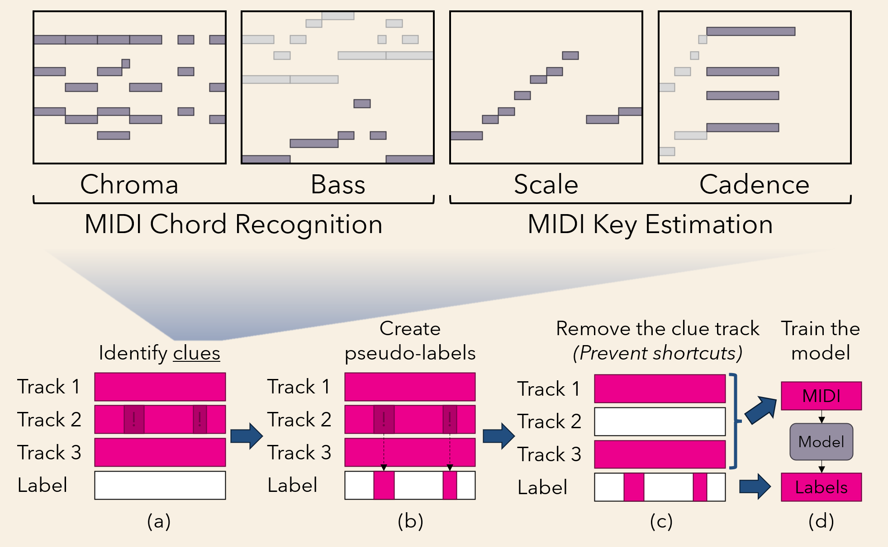

# MIDI AutoLabel Dataset

The official repository for the ISMIR 2025 LBD: **The Music Labels Itself: Content-based MIDI Chord and Key Estimation Without Human Labels**

Arxiv Link: TBA




## MALD Dataset

Containing 350,000 MIDI files with chord, key annotation. MIDI files are from the [Los Angeles (LA) collection](https://github.com/asigalov61/Los-Angeles-MIDI-Dataset).

Download the dataset from [Google Drive](https://drive.google.com/drive/folders/1OcnNUW4GM_Q1pLxaSEIsEbaKB4XqZMcl?usp=drive_link).

### Dataset Format

The dataset is organized in the following structure:

```
dataset/
├── v1-unsupervised.zip/      # Unsupervised version
│   ├── decoded_chords/       # Chord annotations
│   ├── decoded_keys/         # Key annotations
│   ├── decoded_keys_majmin/  # Key annotations, reduced to major/minor modes
├── v1-supervised.zip/        # Supervised version (further fine-tuned on RWC Pop)
│   ├── decoded_chords/       # Chord annotations
│   ├── decoded_keys/         # Key annotations
```

Performance comparison:

Key data

* v1-supervised > v1-unsupervised, since v1-supervised is further fine-tuned on 100 human-annotated songs.
  * On Nottingham dataset (melody only), weighted score (mir_eval asymmetrical) of v1-supervised vs v1-unsupervised: 0.942 vs 0.902
  * On Nottingham dataset (melody+chord), weighted score (mir_eval asymmetrical) of v1-supervised vs v1-unsupervised: 0.976 vs 0.961
* For songs with key changes, both datasets often fail to annotate the exact position of key changes.
* Notice: v1-supervised is not the same as the "supervised" baseline in the paper.

Chord data

* v1-supervised and v1-unsupervised have similar performance. v1-supervised tends to predict 7, 9 and other complex chords less often compared to v1-unsupervised.

### MIDI Files

Please download the original MIDI files from the [Los Angeles (LA) collection](https://github.com/asigalov61/Los-Angeles-MIDI-Dataset). The filenames in the dataset correspond to those in the LA collection.

### Audio Files

You can render the MIDI files to audio using any MIDI synthesizer. We have a script ``render_midi_to_wav.py`` to render the MIDI files using [FluidSynth](https://www.fluidsynth.org/) and the FluidR3_GM soundfont (download [here](https://member.keymusician.com/Member/FluidR3_GM/index.html)).

### Beat/downbeat Annotations

All the MIDI files are filtered to have a relatively reliable beat annotation. Downbeat annotations are not verified. To acquire the beats and downbeats:
```
from pretty_midi_fix import UglyMIDI
midi = UglyMIDI(midi_path)
beats, downbeats = midi.get_beats(), midi.get_downbeats()
```
Note: Please avoid using the original ``PrettyMIDI`` to load the file, since PrettyMIDI does not handle tempo change events on non-zero tracks (fixed in ``pretty_midi_fix.py``), which are pretty common in the dataset.

## Pretrained Models

Download the pretrained models from [Google Drive](https://drive.google.com/drive/folders/1OcnNUW4GM_Q1pLxaSEIsEbaKB4XqZMcl?usp=drive_link).

The pretrained models are located in the `v1/ckpt` folder. Download the entire folder and place it in your `project_root/ckpt` directory.

### Unsupervised Models

The models located in `v1/ckpt/unsupervised` are trained without any human-labeled data.

### Supervised Models

The models located in `v1/ckpt/supervised` are further fine-tuned on 100 songs from the RWC Popular Music Database.

Notice that we do not use the original key labels for RWC Pop. The fixed key labels are in the folder `data/rwc_keys` of this repository.

The key models after supervised fine-tuning are of better quality than the original unsupervised ones. However, the tuned one only produces major/minor modes, while the unsupervised one produces all 7 modes (major, dorian, phrygian, lydian, mixolydian, minor, locrian).

## Running Inference on MIDI files

### Prerequisites

The model is trained mainly on full-band score MIDIs, which assumes:

- The MIDI files should contain **correct beats annotation** (deduced from tempo change events). A performance MIDI file without quantization WILL NOT work.
- Ideally, the MIDI should also contain **correct downbeat annotation** (deduced from tempo change + time signature events). Otherwise, the accuracy of chord boundaries might be affected.
- The model also works on single-track MIDIs, but the accuracy might be lower than full-band MIDIs.

Genre bias:

- LA contains mainly MIDI files for pop music. Other genres (e.g., classical, folk) might have lower accuracy.

### Requirements

The code requires CUDA to run. 8G GPU memory is enough for inference. Lower memory might work but not tested.

### Installation

Clone the repository and install the required packages:

```bash
conda create -n mald python=3.13.2
conda activate mald
pip install torch==2.7.1 --index-url https://download.pytorch.org/whl/cu126
pip install -r requirements.txt
```

### Inference

To run inference on example files:

```bash
python main.py
```

To run inference on custom MIDI files:

```python
from main import analyze
analyze('data/example_midis/000a2a3abdeb6e47294800a45015153d-4-4.mid', use_supervised_model=True, visualize=False)
```

### Visualize the inference results

If you want to visualize the inference results, set `visualize=True` in the `analyze` function. Besides, you need [sonic visualizer](https://www.sonicvisualiser.org/) installed on your system and add it to your system PATH.

If it fails to launch sonic visualizer, you can manually set the path of your sonic visualizer binary in `mir/settings.py`, like:

```python
SONIC_VISUALIZER_PATH="/home/admin/sonic_visualiser/sonic visualiser"
```

Also remember to install:

1. The soundfont to `data/FluidR3_GM.sf2` (download [here](https://member.keymusician.com/Member/FluidR3_GM/index.html)).
2. Fluidsynth (e.g., `sudo apt install fluidsynth` on Ubuntu).

Then run the inference again with `visualize=True`.

```python
from main import analyze
analyze('data/example_midis/000a2a3abdeb6e47294800a45015153d-4-4.mid', use_supervised_model=True, visualize=True)
```

The script should directly launch sonic visualizer with the chord, key annotations and rendered audio loaded. It also contains some feature maps for each subtask:

1. Chord Estimation: Chroma and Bass
2. Key Estimation: Scale (Key Signature) and Cadence

Below is an example screenshot for the predicted chromagram and bass feature maps:


### Chord Evaluation Code

To evaluate chord estimation on the test split of RWC (the test split means the test split for supervised methods; the unsupervised method did not see RWC Pop in any stage of training):

```bash
python chord_eval.py midi-unsupervised-models/cp_transformer_yinyang_probe_encoder_chroma_v0.4_batch_160_la_chords_16_v8_chroma.epoch=00.val_loss=0.15761.ckpt --bass_model_name=ckpt/midi-unsupervised-models/cp_transformer_yinyang_probe_encoder_chroma_v0.5_batch_160_la_bass_16_v2.epoch=00.val_loss=0.10736.ckpt
```
